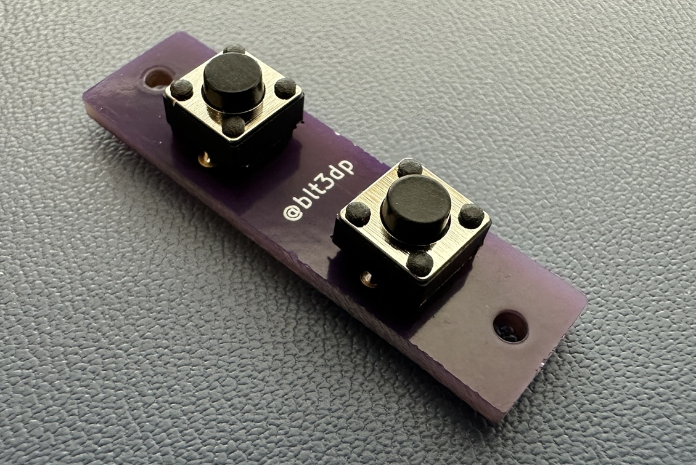

# D-Pad front buttons PCB

This folder contains the KiCad files for the optional front buttons for system power, monitor

power, volume up, and volume down.

Have these boards made by a PCB manufacturer of your choice.  Solder as many buttons as you

plan to use.  These are designed for through hole tact switches measuring 6x6x5mm.  I used

these

[https://www.amazon.com/dp/B07X8T9D2Q](https://www.amazon.com/dp/B07X8T9D2Q)

If you are using this for the volume up and volume down buttons, bridge the jumper pads and

attach a 3 conductor wire.

If you are using this for system power and monitor power, DO NOT bridge the jumper pads and

attach a 4 conductor wire.

Here's what you should end up with when completed.

