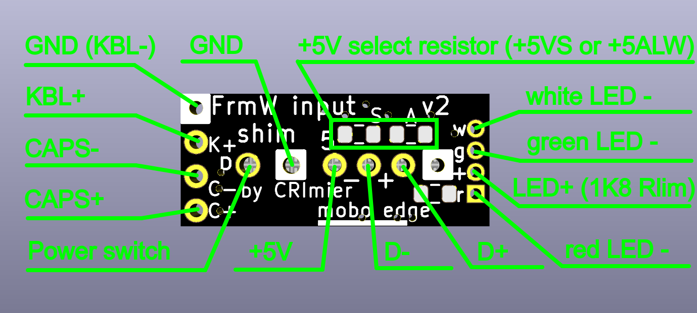

# Original input shim by CRImer

This is a copy of the files for the Framework input shim by CRImer.  I decided to copy them as I

didn't want to clone the entire repository they were in.

The original source for the files can be found here:

[https://github.com/CRImier/MyKiCad/tree/master/Laptop%20mods/framework\_input\_brkt\_smol](https://github.com/CRImier/MyKiCad/tree/master/Laptop%20mods/framework_input_brkt_smol)

Also below is the original README.md content

\*\*\*\*\*\*\*\*\*\*\*\*\*\*\*\*\*\*\*\*\*\*\*\*\*\*\*\*\*\*\*\*\*\*\*\*\*\*\*\*\*\*\*\*\*\*\*\*\*\*\*\*\*\*\*\*\*\*\*\*\*\*\*\*\*\*\*\*\*\*\*\*\*\*\*\*\*\*\*\*\*\*\*\*\*\*\*\*\*\*\*\*\*\*\*\*\*

# Framework input shim

This is a small shim for the Framework laptop motherboard. It exposes the power button,
a USB port with 5V power, keyboard backlight, Caps Lock and fingerprint LED connections.
It is designed to fit inside the outline of the input connector FPC plug,
within the motherboard outline, so that it can easily be added to existing designs.

For wire connections, this shim uses THT holes, since it's relatively easy to rip
an SMD pad off the board by pulling on a wire. This [requires some kapton fixes](../../Images/input-kapton.jpeg)
during assembly, however.

Markings on the PCB: "FrmW input brkt" (shortened because the board has to be very small)

Connector used: Amphenol 10156001-051100LF

These are KiCad 5 files - will be updated to KiCad 6 sometime later.

\#Changes in v3:

* Updated to KiCad 6
* Updated soldermask on connector soldering layer to decrease chances of THT-to-connector shorts
* Cosmetic: removed between-pin traces on a GND group of pins
* Adjusted traces so that there's less visual "shorts"

# Changes in v2:

The input connector symbol numbering was incorrect
and v1 of this adapter could break your mobo or something.

* Signal names are silkscreened on the board's top layers.
* Software: Kicad 6
* Version: 2
* PCB size: 18x7.75
* Layer count: 2

\*\*\*\*\*\*\*\*\*\*\*\*\*\*\*\*\*\*\*\*\*\*\*\*\*\*\*\*\*\*\*\*\*\*\*\*\*\*\*\*\*\*\*\*\*\*\*\*\*\*\*\*\*\*\*\*\*\*\*\*\*\*\*\*\*\*\*\*\*\*\*\*\*\*\*\*\*\*\*\*\*\*\*\*\*\*\*\*\*\*\*\*\*\*\*\*\*

Also, here's CRImer's wiring drawing.

