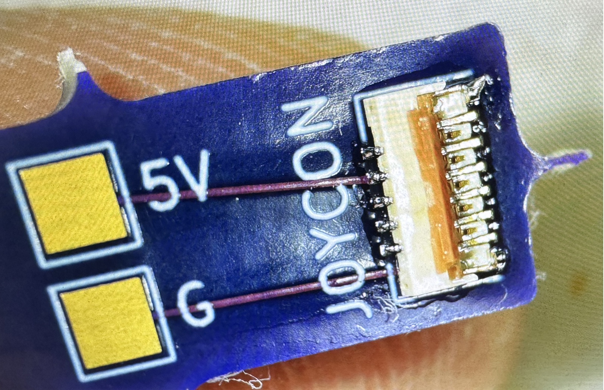

# Joycon charge PCB

This folder contains the KiCad files for the optional front buttons for system power, monitor

power, volume up, and volume down.

Have these boards made by a PCB manufacturer of your choice.  Solder on a FH36W-11S-0.3SHW(99)

as well as a 2 conductor wire

Here's what you should end up with when completed.

